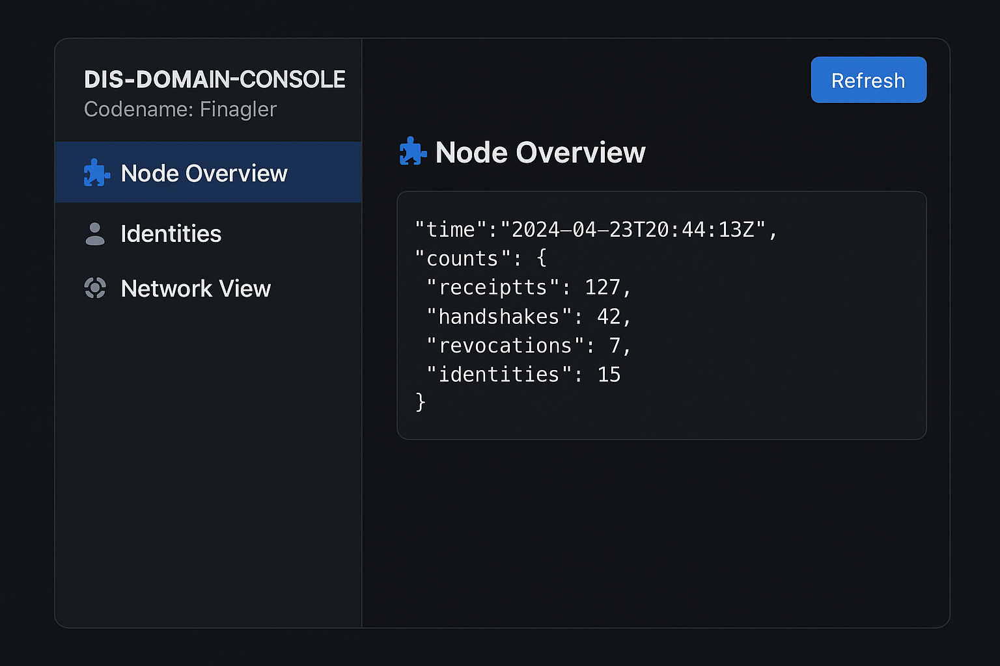

# 🧩 DIS-DOMAIN-CONSOLE (Codename: Finagler)

**Version:** v0.2  
**Status:** Active Development  
**Author:** Rick Fleischman ([@RickF71](https://github.com/RickF71))

---

### 🌐 Overview

**DIS-DOMAIN-CONSOLE**, codename **Finagler**, is the first *visual management layer* for the [DIS-CORE](https://github.com/RickF71/dis-core) network.

It provides a tactile web interface for exploring, linking, and managing nodes within a distributed sovereignty system — a real-time dashboard that lets humans see and shape what the DIS node already knows.

---

### ⚙️ Tech Stack

| Layer | Technology |
|-------|-------------|
| Frontend | React + Vite |
| Styling | TailwindCSS |
| Backend API | [DIS-CORE](https://github.com/RickF71/dis-core) (Go) |
| Runtime | Node.js v22+, npm v11+ |
| License | MIT (planned) |

---

### 🚀 Quick Start

#### 1️⃣ Clone the project

```bash
git clone https://github.com/RickF71/dis-domain-console.git
cd dis-domain-console
